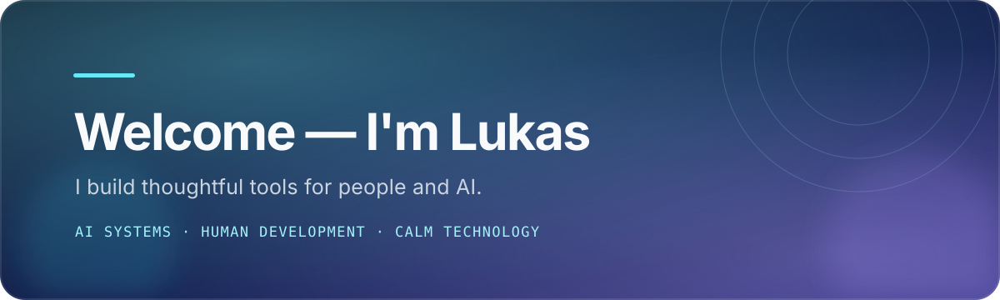

<!-- GitHub profile README -->

  

 

## A little about me

I'm a **design engineer in Stockholm**. I turn complex domains into product surfaces that feel calm, fast, and obvious — then polish the details users actually feel.

I work across product strategy, design, front-end engineering, and AI workflow architecture. Right now, I'm especially interested in interfaces that make autonomous work visible, understandable, and trustworthy.

Currently, I'm knee-deep in exploring **AX — Agent Experience** — and very excited about where it's going. I'll be releasing something here soon.
